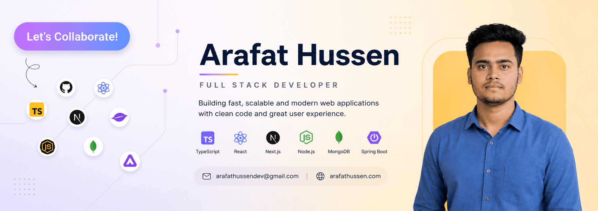

<!-- Banner -->

  

 

<!-- Title -->
<h1 align="center">Hi 👋, I'm Arafat Hussen</h1>

<!-- Typing Animation -->

  

 

<!-- About Me -->
## 👨‍💻 About Me

- 👋 Hi, I'm **[@arafathussen](https://github.com/arafathussen)**
- 💻 I'm a **Full-Stack Developer** focused on building modern, scalable, and user-focused web applications.
- 🎨 I work with **React.js, Next.js, JavaScript, TypeScript, and Tailwind CSS** for frontend development.
- ⚙️ I use **Node.js, Express.js, PostgreSQL, Prisma, Supabase, and REST APIs** for backend development.
- 🤖 I build **AI-powered applications** and integrate intelligent AI capabilities into modern web solutions.
- 🐍 I work with **Python Automation, Bot Development, and Workflow Automation**.
- 🔄 I use **n8n** to build automated workflows and integrate services.
- 🎬 Beyond development, I'm also interested in **Content Creation, Video Editing, and Creative Media**.
- 💬 Ask me about **Full-Stack Development, AI-Powered Applications, Python Automation, Bots, and Workflow Automation**.
- 🌐 Explore my **[Portfolio](https://arafathussen.com)**
- 📫 Reach me at **[arafathussendev@gmail.com](mailto:arafathussendev@gmail.com)**

<!-- Resume will be added later -->
<!-- 📄 View My Resume: Add resume link here -->

 

<!-- Socials -->
## 🌐 FOLLOW ME ON SOCIALS:

  
  

 

<!-- Technology Stack -->
## 🛠️ TECHNOLOGY STACK:

### Languages:

### Frontend Frameworks & Libraries:

### Backend Development:

### Database & ORM:

### AI & Automation:

  
  &nbsp;
  
  &nbsp;
  
  &nbsp;
  
  &nbsp;
  
  &nbsp;
  

### Deployment & Cloud Platforms:

  
  &nbsp;
  

### Tools & Technologies:

### Creative & Media Tools:

  
  &nbsp;
  
  &nbsp;
  

 

<!-- GitHub Statistics -->
## 📊 GITHUB STATISTICS & ANALYSIS:

### GitHub Streak:

  

### Top Languages:

  

 
 

<!-- Random Developer Quote -->
## 💡 RANDOM DEV QUOTE:

  

---

<!-- Profile Views -->

  

